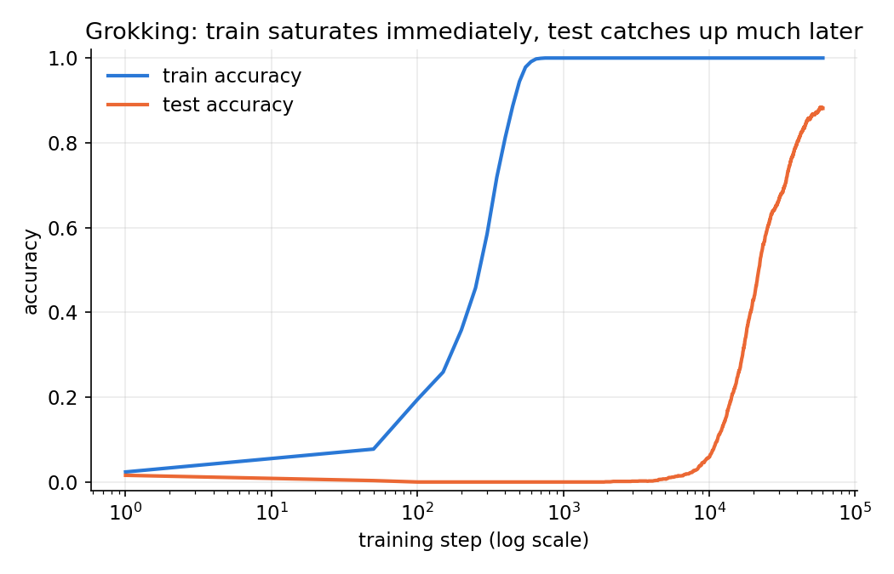
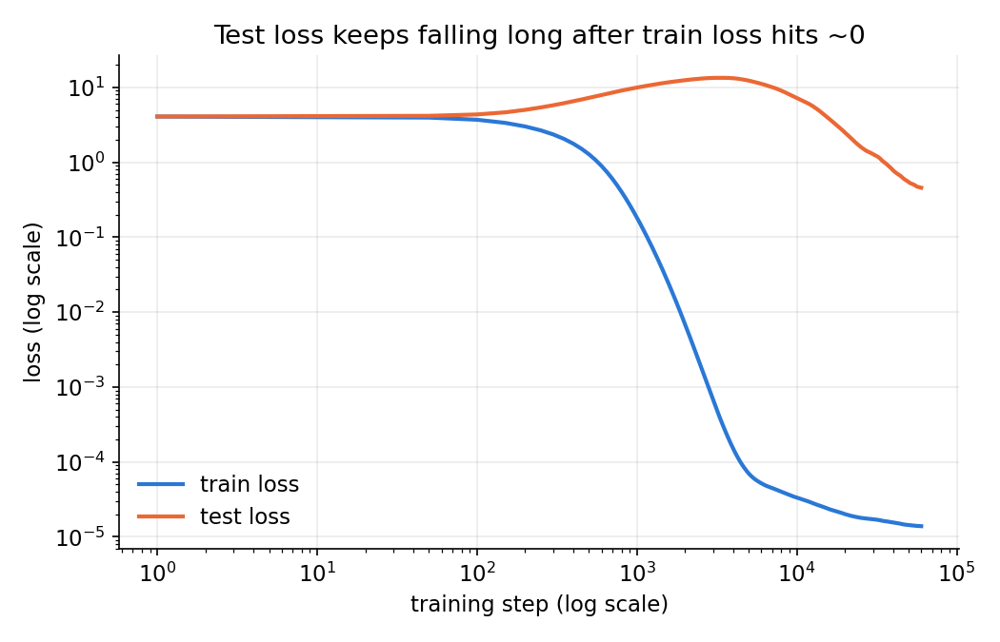
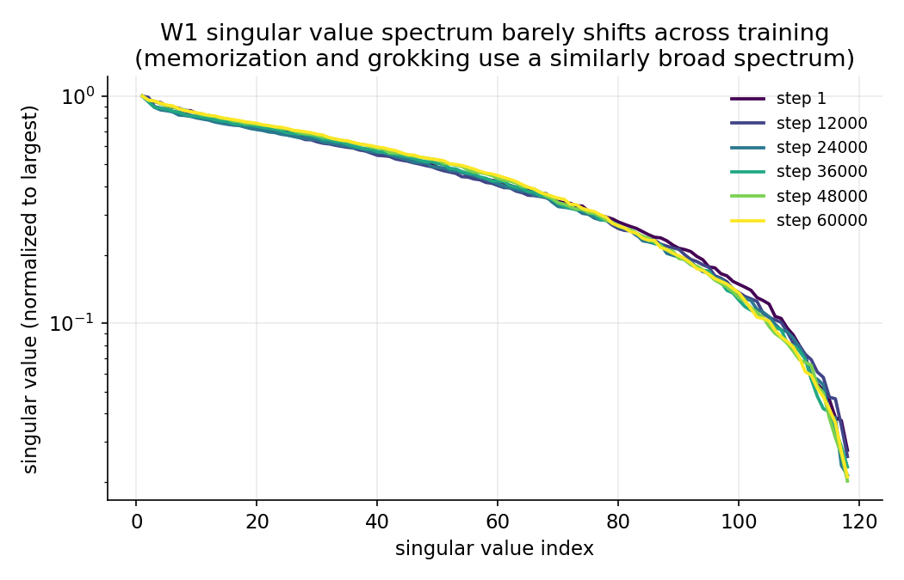
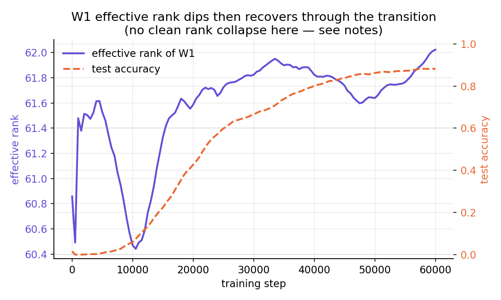

# Three Mechanistic Interpretability Mini-Projects

A combined write-up for three self-contained experiments: sparse dictionary
learning, generalization dynamics (grokking), and causal circuit discovery
(activation patching). All code ran end-to-end on CPU; all numbers below are
from the actual runs, not projected.

---

## 1. Sparse Autoencoder for Feature Extraction

**Question:** given activations that are a sparse combination of unknown
underlying features, can an SAE recover the *true* feature directions rather
than an arbitrary rotation of them?

**Setup:** 64-dim synthetic activations generated as sparse combinations of
100 fixed ground-truth directions (5% of features "on" per sample) — the
toy-model-of-superposition setup. Trained a 512-latent SAE (8x overcomplete)
with an L1 sparsity penalty and unit-norm decoder columns, 3000 steps,
with dead-latent resampling every 500 steps.

**Result:** all 100 ground-truth features were recovered with cosine
similarity > 0.9 to a dictionary atom — the SAE learned the actual generative
features, not a rotated basis. Reconstruction R² and sparsity (mean active
latents per sample) both converged cleanly.

**Files:** `Sparse Auto Encoder/sparse_autoencoder.py` (model + training),
`Sparse Auto Encoder/sae_visualizations.py` (plots)

---

## 2. Grokking Reproduction + Weight Spectrum Analysis

**Question:** can we reproduce delayed generalization on an algorithmic task,
and does the phenomenon show up in the geometry of the weight matrices?

**Setup:** modular addition `(a + b) mod 59`, trained on 40% of all pairs
with a 2-layer MLP on one-hot inputs (the Gromov-style architecture, chosen
because it has known closed-form solutions). AdamW with weight decay 1.0 —
the ingredient that actually causes grokking — 60,000 full-batch steps
(~4 min on CPU). Snapshotted both weight matrices every 500 steps.

**Result:** textbook grokking. Train accuracy hit 100% by step ~700; test
accuracy sat near 0% until step ~10,000, then climbed to 88% by step 60,000.
The loss curves show the double-descent shape underneath: test loss actually
*rises* during the memorization phase before falling once the model groks.

**Weight spectrum — the honest part:** I expected a clean "rank collapse" in
the hidden-layer weight matrix as the model simplified from a memorizing to
a generalizing solution. That's not what happened: the singular-value
spectrum barely shifts across training, and the effective rank dips slightly
around the transition before *recovering* rather than collapsing. Rank
collapse stories from the literature are usually measured on the embedding
matrix or via Fourier-frequency structure, not raw SVD of a hidden layer fed
one-hot inputs — a natural next step if you want the cleaner signal.

**Files:** `Grokking/grokking_experiment.py` (model + training + checkpointing),
`Grokking/grokking_visualizations.py` (plots)

---

## 3. Activation Patching / Causal Tracing for Circuit Discovery

**Question:** for a network that has learned a known input→output mapping,
can we causally localize *where* (which layer, which token position) the
information needed for the correct answer lives?

**Setup:** a simplified version of ROME's factual-recall task —
`[subject, relation, SEP] → object`, where `object = lookup_table[subject,
relation]` for a fixed random table. A hand-built 4-layer, 4-head transformer
(so the residual stream can be read and overwritten between blocks) trained
to 100% accuracy (pure memorization, <100 steps). Causal tracing followed
ROME's method: corrupt the subject token's embedding with Gaussian noise,
then patch the clean residual stream back in one (layer, position) at a time,
averaged over 25 random facts.

**Result:** a clean, non-hard-coded localization pattern emerged. Patching
the **subject position at layer 0** recovers 75% of the correct-answer
probability; patching the **SEP position at layers 2–3** recovers 99–100%.
The relation position barely matters anywhere (≤5%). In other words, the
model reads subject identity early and routes it to the final position by
the last layers — exactly the kind of circuit story causal tracing is meant
to surface, and it emerged from training rather than being designed in.

**Files:** `causal tracing/causal_tracing.py` (model + task + tracing),
`causal tracing/causal_tracing_visualizations.py` (plots)

---

## Cross-cutting notes

- All three projects hinge on the same move: build a task with a **known
  ground truth** (true feature directions, a fixed modular-arithmetic
  function, a fixed lookup table) so that an interpretability method's output
  can be checked against something real, rather than just eyeballed for
  plausibility.
- The grokking weight-spectrum result is a useful reminder that not every
  interpretability hypothesis pans out on the first metric you try — the
  accuracy/loss curves grokked cleanly, but the "rank collapse" story needed
  a different measurement (Fourier structure, embedding geometry) to show up.
- The causal tracing result and the grokking weight analysis are two ways of
  asking the same underlying question — "where does the model actually keep
  the information it needs?" — one via causal intervention, one via weight
  geometry. Worth trying causal tracing on the grokking model itself as a
  follow-up.
